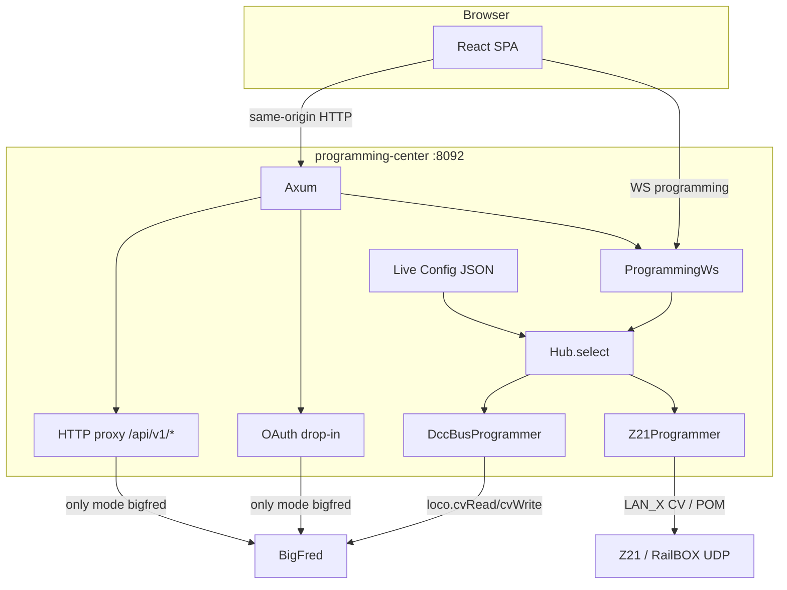
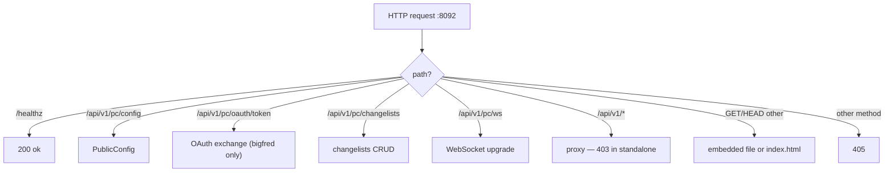

# Programming Center — Architecture

programming-center is the decoder-programming kiosk that sits in front of
[BigFred](https://github.com/dcc-bigfred/bigfred) on the hub tablet
(`:8092`), or talks UDP to a Z21 / RailBOX with BigFred turned all the
way off. One process serves three things:

- the embedded React SPA (`web/dist`, via `rust-embed`),
- `/api/v1/pc/*` — public config, confidential OAuth token exchange, and
  the programming WebSocket,
- everything else under `/api/v1/*` — reverse-proxied to BigFred **only**
  when `mode` is `bigfred`.

Hub OS pulls the static **linux/arm64** binary from this repo’s CI
artifacts (same pattern as [bigfred-wizard](https://github.com/dcc-bigfred/bigfred-wizard)).
Overlays (init.d, microinit, microdns) live in
[bigfred-os](https://github.com/dcc-bigfred/bigfred-os).

This document is the canonical architecture reference. The
[README](README.md) is the end-user description; coding standards live in
[CODING-GUIDELINES.md](CODING-GUIDELINES.md) (copy of LongFred’s, same
org-wide Rust standard).

---

## 1. Assumptions

1. **Kiosk on `:8092`.** 8090 is OS UI, 8091 is wizard. This binary never
   owns the rails: either BigFred dcc-bus or a configured Z21 does.
2. **No TLS.** `reqwest` without rustls/native-tls. `bigfred.address` is
   `host:port` (default `bigfred.local:8080`); the daemon prefixes
   `http://` / `ws://`. On the hub that is local; a laptop sets
   `127.0.0.1:8080`.
3. **`mode` is integration, not the programming track.** JSON
   `mode: bigfred | standalone` selects the whole BigFred stack vs none.
   The programming track lives in the URL as `track=prog|pom` so it does
   not collide with wizard’s `mode: prog|pom` on dcc-bus.
4. **`standalone` means zero BigFred.** No SSO, no HTTP proxy, no
   command-station catalogue. Stronger than wizard’s
   `locoProgramming.mode: direct`, which still signs in through BigFred.
5. **Hot-reload JSON, cold-bind HTTP.** Config is watched (inotify,
   300 ms debounce). Invalid JSON keeps the previous snapshot. Changes
   to `http` / CORS need a process restart. `mode` and `z21.*` take
   effect on the next WebSocket command (`Hub::select`).
6. **`enabled: false` until an operator turns it on.** Fresh images do
   not expose the kiosk.
7. **JWT is a layout session, not RBAC here.** Permissions stay in
   BigFred. This daemon forwards `{error, detail}`. Standalone has no
   RBAC.
8. **Query is the source of truth.** Screens are `path + query` so the
   browser Back button works. No `location.state`. Defaults:
   `track=prog`, `address=0`.
9. **Offline SPA.** Vite targets `chrome87`.
   `web/scripts/check-offline-bundle.mjs` fails the build if `dist/`
   would fetch fonts/scripts from a CDN.
10. **musl arm64 + amd64.** Allocation-conscious tokio/HTTP daemon
    (CODING-GUIDELINES §2), not firmware-heapless.
11. **One programming session.** The browser holds one WebSocket to
    programming-center (`cv.read` / `cv.write` / `cv.bitop`).

---

## 2. Rules and growth patterns

Review filter — not a restatement of CODING-GUIDELINES.

- **No God-structs.** Config, OAuth, proxy, WS hub, and each bus
  adapter are separate modules.
- **Registry, not an `if` ladder.** A new decoder is a new TypeScript
  array + `register` in `web/src/decoders/`. A new feature is a
  `FeatureModule` in `web/src/features/registry.ts` (left navigator).
  A new WS command is a new file + match arm. A new volume mapping is an
  entry in `web/src/features/volumeMap.ts`. Output mapping encode/decode
  is a frontend module (`zimoMapping.ts`); other brands add their own
  page behind `MappingPage`.
- **Closed set, enum dispatch on the CV path.**
  `ProgrammingBus = DccBus | Z21`. `Hub::select(&live.mode)` — not
  `Box<dyn>` on the hot path (guidelines §8.2). The SPA feeds one
  `CvListPage` from `CvItem[]`.
- **Direct CV ops.** Features compute on the frontend and call raw
  `cv.read` / `cv.write` / `cv.bitop`. Volume percent 0–100 lives in
  `volumeMap.ts`; Apply writes the mapped master CV. Mapping bits live in
  `zimoMapping.ts`; Apply writes the staged CVs.
- **Adapter.** dcc-bus frames and Z21 UDP hide behind `ProgrammingBus`.
- **Errors.** Envelope `{error, detail}`. Forward BigFred / Z21 codes.
  The SPA i18n-looks-up the code; a missing translation shows the
  generic string plus the code, never a raw i18n key as the CV
  description.

---

## 3. Architecture



Boot in `crates/programming-center/src/main.rs`: load/seed config,
ensure the OAuth drop-in **when** `mode == bigfred`, spawn the inotify
reloader, bind `:8092`, serve until SIGINT/SIGTERM.

---

## 4. Workspace

```
programming-center/
├── Cargo.toml                 # workspace: pc-core, pc-proto, programming-center
├── Makefile
├── README.md
├── docs/speed/                # ZIMO / ESU speed-curve notes (English)
├── docs/mapping/              # ZIMO output-mapping notes (English)
├── ARCHITECTURE.md            # this file
├── CODING-GUIDELINES.md
├── LICENSE                    # Apache-2.0
├── crates/pc-core/            # bitop, NMRA validation — no network I/O
├── crates/pc-proto/           # WS JSON envelope
├── crates/programming-center/ # Axum daemon, Diesel SQLite, both bus adapters, rust-embed
└── web/                       # Vite + React 18 + MUI + i18next (pl/en/de, fallback pl)
```

Dependencies: `bigfred-shared-daemon` (config + datadir, no Unix IPC),
`bigfred-client` (path to the sibling `dcc-bigfred/bigfred` tree),
`dcc-bigfred-proto-z21`, Diesel 2 + bundled SQLite.

Memory profile of the daemon: **allocation-conscious**.

---

## 5. Config

Path: `$DATA_DIR/etc/bigfred/programming-center/config.json`
(`DataDir`, `EnvPolicy::BigfredThenDataDir`). Missing file →
`JsonFile::create_default()` (pretty JSON + `\n`).

Watch: rust-commons `WatchSpec::file` + `try_reload` (debounce 300 ms).

OAuth drop-in `$DATA_DIR/etc/bigfred/oauth-clients/programming-center.json`
is seeded **only** when `mode == bigfred` (including a reload into that
mode). That file is BigFred’s, not ours.

`GET /api/v1/pc/config` returns `PublicConfig` (no secrets): `enabled`,
`mode`, `ssoClientId`, `redirectUris`, `idleTimeoutSecs`,
`stationPicker`, `loginRequired`, `bigfredPublicUrl` (bigfred only),
`z21` (standalone only). The SPA polls about every 15 s and hides SSO
as soon as `mode` becomes `standalone`.

Default seed: `enabled: false`, `mode: bigfred`,
`bigfred.address: bigfred.local:8080`, `z21.hostname: 192.168.4.1`,
`z21.port: 21150`. `z21` is read only in standalone; missing hostname or
port → `z21_not_configured`.

SQLite (Diesel 2): `$DATA_DIR/var/lib/bigfred/programming-center/db.sqlite3`.
Created on first start. `embed_migrations!` runs pending Diesel migrations
at process start (`PRAGMA foreign_keys = ON`). One file for the whole
daemon; new tables are new migrations, never a second `.sqlite` file.

---

## 6. HTTP dispatch



The proxy never Upgrade’s to BigFred. Unknown SPA paths fall back to
`index.html`. Hashed assets get `Cache-Control: immutable`; `index.html`
is `no-cache`.

Named CV snapshots (**listy zmian**) are REST under `/api/v1/pc/changelists`
(GET `?decoder=`, POST, PATCH `/:id`, DELETE `/:id`). `403 pc_disabled`
when `enabled` is false. They live in SQLite, not the browser, so logout
does not clear them. Lists are per decoder id (SPA sends
`canonicalDecoderId`) and are shared on the hub.

---

## 7. SSO

Only `mode: bigfred`. Confidential OAuth client (`ssoClientId:
programming-center`). Flow: public config → BigFred authorize with
`layout_id` → `POST /api/v1/pc/oauth/token` (daemon adds the secret) →
access token in `sessionStorage`. `bigfred.address` is both the HTTP/WS
base and the public SSO origin (`http://{address}`).

`/login` and `/auth/callback` redirect home in standalone.
`ApiError` + `From<bigfred_client::Error>` match wizard.

---

## 8. SPA

`web/` — Vite, React 18, MUI, react-router, i18next (`pl` fallback).
Unit tests: Vitest + Testing Library (`cd web && npm test`; `make test-web`).

| Path | Query | Role |
|---|---|---|
| `/login` | — | SSO (bigfred only) |
| `/auth/callback` | OAuth | SSO (bigfred only) |
| `/` | `station`, `decoder` | overview; decoder tiles (plus Detect via CV 8) and the left-nav picker. Choosing a decoder (tile, Detect, or Navigator) reads CV 1/17/18/29 on the programming track and fills query `address` only when the session address is `0` |
| `/cv` | `station`, `decoder`, `address`, `track`, `cv` | Direct CV accordion (stages into CvRegistry) |
| `/speed` | same without `cv` | NMRA sliders, ZIMO drag charts, or LokSound v5 ESU charts; stages CVs. ZIMO and LokSound v5 `ensureRead` speed CVs on entry only when they are missing from the registry (prog/POM is transport, not a cache key). **Odczytaj** force-reads. |
| `/address` | same without `cv` | DCC address (CV 1 / 17 / 18 / 29); stages, does not change query `address` until Apply |
| `/volume` | same without `cv` | Volume 0–100 stages the mapped master CV (`volumeMap` + `cv.read`) |
| `/mapping` | same without `cv` | Output mapping; ZIMO MS/MN only (`zimoMapping` + `cv.read`). `ensureRead` of missing CVs on entry; **Odczytaj** force-reads. |
| `/backup` | `station`, `address`, `track` (no decoder required) | Dump / restore CVs; does not use CvRegistry |

The shell is a Paperbase-style layout: dark left navigator, blue header,
grey content well. Feature entries are `<Link>`s that keep the current
query. AppShell hides the command-station picker in standalone; the
status line then shows `Z21 host:port`. Query `station` is ignored in
standalone.

Edits do **not** write the decoder immediately. The SPA keeps one observed
CV table (`Record<cv, value>`) in `CvRegistry` (`sessionStorage` key
`programming-center.cvRegistry`), scoped by `decoder|address|station`.
Changing that scope loads a different table so two locomotives are not
mixed. Programming-track vs POM (`track` in the query) does not change
the table — it only goes on the next `cv.read` / `cv.write`. A field or
wizard change (slider, chart drag, address, volume, mapping)
writes into the table; a locomotive **read** fills both the table and the
baseline, so it is not a pending change. The left-nav **Zmiany** list is
`table` minus `baseline`. **Zaaplikuj** sends one `cv.write` of those diffs.
**Odrzuć** copies baseline over the table. The plus next to **Zmiany**
saves the current diffs as a named changelist (POST). Left-nav **Lista
zmian** expands saved names; an arrow (or “Wczytaj do obecnych zmian”)
merges those CVs into the session table (`setMany`). **Zastąp obecnymi
zmianami** overwrites the saved snapshot (PATCH). Volume Apply writes the mapped
master CV from `volumeMap.ts`.
If Apply wrote CV 1 / 17 / 18, the programming-target `address` query is
updated so POM follows the new DCC address. Selecting a decoder (home
tiles, Detect, or the Navigator) reads those CVs on the programming track
and fills `address` only when the session address is `0`.

Any `cv.read` shows a full-viewport overlay
(“Odczytuję CV… / Anuluj”). In **standalone**, the daemon streams
`cv.progress` (current CV, `done`/`total`, value or `failed`); the overlay
shows a determinate bar and a short CV list, and values are
`rememberRead` as they arrive so the page behind the overlay updates.
**Anuluj** sends `cv.read.cancel` (same `id`) and stops the Z21 loop
between CVs. A late `ack` is ignored. BigFred still waits for one `ack`
(spinner only). Writes are not covered, except backup restore which uses the
same overlay. Backup dump sets `liveApply: false` so the loco table is
untouched. **Kopia zapasowa** (`/backup`) is always in the left nav
(no decoder required). Dump and restore call `cv.read` / `cv.write`
directly and never touch CvRegistry. Dump default range is CV 1–1000
(`from`/`to`/`skipAddress` on the payload). A failed CV 1 probe returns
`decoder_absent` and does not walk the rest of the list.

**CV list:** one `CvListPage` fed by the selected decoder’s `CvItem[]`.
`groupKey` on a CV gathers matching items into one collapsible section
(shown where the first member would appear; starts collapsed). `cv=`
inside a group expands that group. Collapsed row: **`CV{n}`** large,
description small (or nothing). Expand is accordion, one CV open at a
time, open CV in `cv=` (Back collapses). No auto-read on expand.
`kind`: `number` | `enum` | `bits`. Button: Read this CV. Valid edits
stage into the session table. Bits: radio per documented bit; unknown
bits stay as read (or 0). Validation is frontend-only (out of range is
not staged). Catalogue defaults are display-only and are not inserted
into the table on mount.

Command stations: `GET /api/v1/layouts/{id}/command-stations`, filter
`programming: true`. 401/403 surface the BigFred code.

---

## 9. Programming WebSocket

`ws://…/api/v1/pc/ws?token=` — `token` required only in `bigfred`.

Envelope `{ type, id, payload }`. Ack `{ ok, error, detail, cvs, errors }`.

| type | Role |
|---|---|
| `cv.read` | Direct read. Payload may list `cvs` and/or inclusive `from`–`to`, plus `skipAddress`. |
| `cv.progress` | Standalone only. Same `id` as the read. `{ total, done, current?, cv?, value?, failed? }` before and after each CV. |
| `cv.read.cancel` | Standalone: stop the in-flight read (`id` of that `cv.read`). No ack. |
| `cv.write` | Direct write |
| `cv.bitop` | RMW: `new = (old & andMask) \| orMask` |

Dump/restore of many CVs: the daemon probes CV 1 first, then chunks
dcc-bus frames to stay under the 30 s ack timeout. Per-CV failures come
back in `errors` (`ok` stays true). `loco.cvRead` / `loco.cvWrite` on
dcc-bus do the same (partial `cvs` + `errors`). Standalone reads stream
progress instead of one long wait.

New command = new file + match arm in `ws.rs`.

---

## 10. CV Hub

`Hub::read_cvs` / `write_cvs` take live `mode` per command. Standalone
→ `Z21Programmer`; bigfred → `DccBusProgrammer` (`request_to` with
explicit `station_id`). Changing `z21.hostname` / `port` on reload
drops the UDP socket (`Hub::drop_z21`) so the next command reconnects.
Both adapters return successful slots plus `errors` (CV numbers that
failed). The SPA never talks to Z21 or dcc-bus directly.

`DccBusProgrammer` needs a JWT and a positive `station_id`.
`Z21Programmer` ignores both.

---

## 11. Decoder catalogues

Frontend tables, one file per decoder, sourced from
[docs](https://github.com/dcc-bigfred/docs) (`zimo-ms-mn`,
`esu-loksound-5`, `railbox-rb23xx`; LokSound v4 from the ESU manual).
Generic `nmra` is NMRA configuration CVs only (no volume).
Copy lives in `web/src/i18n/{pl,en,de}.json` (`decoder.*`, `catalog.*`);
the TypeScript arrays only hold keys, ranges, defaults and allowed
values. Missing translation for the active language means no
description under the CV number (never the raw i18n key). Known
defaults prefills the editor before a read and are shown as
“Wartość domyślna: n”. Out-of-range values are not staged.

Volume mapping lives in `web/src/features/volumeMap.ts`. Apply writes the
master CV via Direct `cv.write`:

| decoder id | CV | 100% |
|---|---|---|
| `zimo-ms450` | 266 | 65 |
| `loksound-v5` | 63 | 192 |
| `loksound-v4` | 63 | 64 |
| `rb23xx` | 203 | 64 |

Output mapping is ZIMO-only today (`/mapping` → `ZimoMappingPage`). Bits
are encoded in `web/src/features/zimoMapping.ts`; notes in
`docs/mapping/zimo.md`.

---

## 12. Security and limits

- No TLS, no RBAC inside programming-center.
- One programming WebSocket session from the tablet.
- In `bigfred` the layout must be open in BigFred (dcc-bus).
- Standalone has no command-station catalogue and no proxy.
- `enabled: false` by default.
- Proxy refuses `Upgrade`.
- Idle logout uses `idleTimeoutSecs` (default 86400) when a token is present.
- Header **Wyloguj / Zresetuj** is always shown (SSO and standalone). It
  clears `sessionStorage` (token, OAuth state, CV table, layout pick),
  drops the in-memory CvRegistry, and goes to `/login` when SSO is
  required, otherwise `/` with `track=prog&address=0`.
