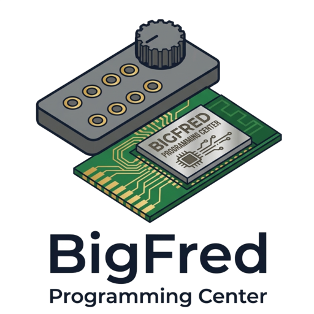
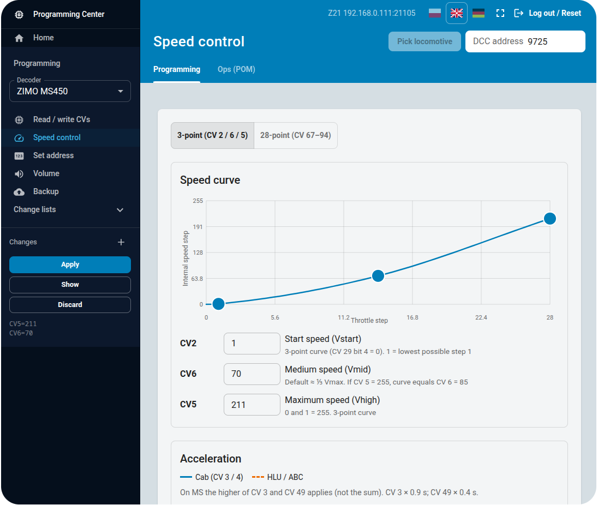

# Programming Center

Decoder programming made easy and for everyone.

<p align="center">
  
</p>

## What you can do

<p align="center">
  
</p>

- Pick a decoder in the left menu (ZIMO MS450, ESU LokSound v4 / v5, RailBOX RB23xx)
- Read and write CVs one at a time (accordion list from the decoder catalog)
- Set the NMRA 3-point speed curve (CV 2 / 6 / 5) plus accel / brake (CV 3 / 4)
- Set the DCC address (short CV 1, or long CV 17/18 and CV 29 bit 5)
- Set master volume 0–100 (mapped to CV 266 / 63 / 203 by decoder)

## Run

```bash
make web-build
make host          # native binary at target/release/programming-center
# or, during development:
make dev-backend   # Axum on :8092
make dev-web       # Vite on :5176, proxies /api to the daemon
```

Health: `GET /healthz`. The kiosk stays off until you set `"enabled": true`.

## Configuration

JSON at `$DATA_DIR/etc/bigfred/programming-center/config.json` (created on
first start). Hot-reload: a bad file keeps the previous snapshot. Changes
to `http` / CORS need a process restart.

```json
{
  "http": "0.0.0.0:8092",
  "enabled": false,
  "mode": "bigfred",
  "bigfred": { "address": "bigfred.local:8080" },
  "z21": { "hostname": "192.168.4.1", "port": 21150 },
  "ssoClientId": "programming-center",
  "redirectUris": [
    "http://bigfred.local:8092/auth/callback",
    "http://programming-center.local:8092/auth/callback",
    "http://localhost:8092/auth/callback"
  ],
  "corsEnabled": false,
  "corsOrigins": [],
  "idleTimeoutSecs": 86400
}
```

- `mode: "bigfred"` — SSO, proxy, command-station picker, CV via dcc-bus.
- `mode: "standalone"` — no BigFred; CV via UDP to `z21.hostname:port`.

`bigfred.address` is `host:port` without a scheme. The daemon adds `http://`
and `ws://`.

## Technical docs

[ARCHITECTURE.md](ARCHITECTURE.md). Rust / TypeScript rules:
[CODING-GUIDELINES.md](CODING-GUIDELINES.md). License: Apache-2.0.

This project is part of the [BigFred](https://github.com/dcc-bigfred) ecosystem.
